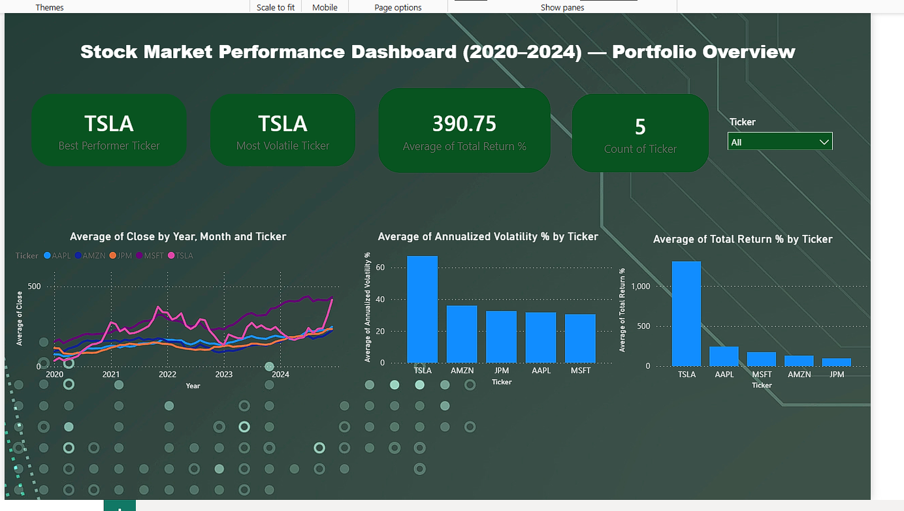

# Stock Market Performance Analysis

## Overview
Analysed 5 years (2020–2024) of historical stock price data for 5 major companies 
across different sectors (Apple, Microsoft, JPMorgan, Tesla, Amazon) to evaluate 
returns, volatility, and correlation.

## Tools Used
- **Python** (yfinance, Pandas, NumPy, Matplotlib, Seaborn) — data collection, 
  returns/volatility calculation, and visualization
- **SQL** — business queries, window functions, and self-joins
- **Power BI** — interactive dashboard with a multi-table data model

## Key Findings
- 🚀 TSLA delivered the highest total return over the period, but also carried 
  the highest annualized volatility — a clear illustration of the risk-return tradeoff
- 📉 March 2020 stood out as the worst month across most stocks, coinciding with 
  the COVID-19 market crash
- 🏦 JPM showed comparatively low volatility relative to tech/growth stocks, 
  consistent with its profile as an established financial institution
- 🔗 Tech stocks (AAPL, MSFT) showed higher correlation with each other than 
  with JPM, highlighting the value of cross-sector diversification

## Dashboard Preview

## Repository Structure
- `stock_analysis.ipynb` — Python data collection, returns/volatility analysis, and charts
- `stock_analysis_queries.sql` — 6 SQL business queries (aggregation, window functions, self-joins)
- `stock_dashboard.pbix` — Power BI interactive dashboard (multi-table model)
- `charts/` — exported chart images from Python analysis
- `dashboard.png` — dashboard screenshot
- `stock_data.csv` / `stock_summary.csv` — exported datasets used in Power BI

## How to Run
1. Clone the repo
2. Open `stock_analysis.ipynb` in Jupyter or Kaggle
3. Run all cells (requires internet access for `yfinance` to pull live data)
